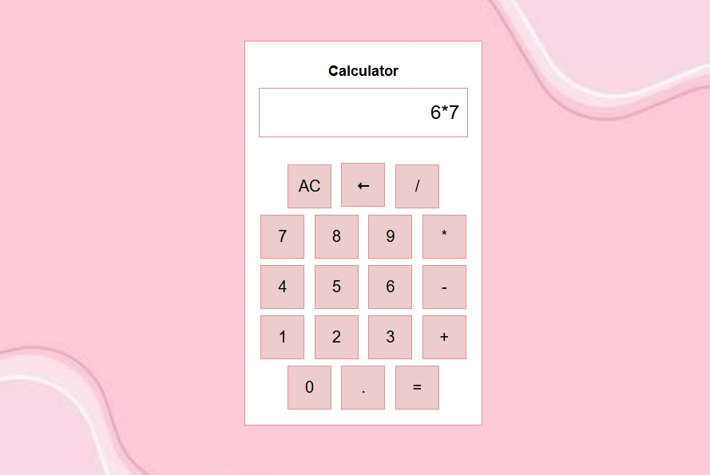

# Simple Calculator Web App 🧮

A clean, lightweight, and fully functional calculator built with pure HTML, CSS, and JavaScript. No frameworks, no libraries — just vanilla code!

## Features ✨
- Basic arithmetic operations: `+`, `−`, `×`, `÷`
- All Clear (AC) and Backspace (←) buttons
- Decimal point support
- Keyboard input support (numbers, operators, Enter, Backspace, Escape)
- Error handling (shows "Error" for invalid expressions)
- Responsive and minimal design
- Works offline

## How to Use
1. Download or clone this repository
2. Open `index.html` in your browser
3. Start calculating!

## Files
- `index.html` → Structure of the calculator
- `styles.css` → Simple black & white styling (or your custom style)
- `script.js` → All the logic using safe `eval()` for calculation

## Screenshot
- Calculator Preview

## License
This project is open-source and free to use, modify, and share ❤️

Made with love for learning web development!